# NVS Architecture Options and Recommendation

> **Status:** Proposed for D2 review  
> **Date:** 2026-07-14  
> **Architecture phase:** Discovery; no production implementation authorized

## 1. Architectural objective

NVS should independently validate NILES business behavior and produce reproducible release evidence without rebuilding mature test infrastructure.

The architecture must support three different forms of truth:

1. **Declared truth** — OpenAPI, metadata, process definitions, role policies, SLA definitions, and approved invariants.
2. **Executed truth** — What happened through the real NILES API or UI for a real test actor.
3. **Observed truth** — Persisted state, audit, events, jobs, SLA ledger, notifications, traces, and other side effects.

A result is trustworthy when these forms can be correlated and compared.

## 2. Primary constraints

- NVS is externally deployable and independently versioned.
- NVS must not bypass the authorization or process behavior it claims to test.
- Manual scenario authoring must be minimized.
- Release-gating assertions must be deterministic.
- AI may assist but cannot become the sole oracle.
- UI automation must survive non-semantic layout changes.
- SLA and asynchronous workflows must be testable without arbitrary sleeps.
- Roles, ownership, and tenant isolation must be validated at the API boundary.
- Evidence must be redacted, reproducible, and safe to retain.
- The MVP must remain small enough to prove the architecture before building a platform around it.

## 3. Options considered

### Option A — Fully custom validation platform and execution engines

Build custom browser automation, API generation, model traversal, reports, scheduling, evidence storage, and UI.

**Advantages**

- complete control;
- one implementation language and release lifecycle;
- no adapter boundaries.

**Disadvantages**

- duplicates mature infrastructure;
- large maintenance and browser-compatibility burden;
- delays NILES-specific value;
- creates avoidable reliability and security risk;
- broadens the project before the product hypothesis is proven.

**Decision:** Reject.

### Option B — Adopt one generic commercial AI testing product

Use a hosted or self-hosted generic platform for recording, generation, execution, healing, and reporting.

**Advantages**

- fast generic UI coverage;
- potentially low initial authoring effort;
- managed execution and triage features.

**Disadvantages**

- generic product semantics;
- incomplete NILES metadata, SLA, state, authorization, ownership, and tenant oracles;
- opaque healing or classification risk;
- data-residency and vendor-lock-in concerns;
- release evidence may not be sufficiently deterministic or portable.

**Decision:** Do not choose as the core architecture. A commercial runner may be evaluated later behind an adapter.

### Option C — Domain-aware orchestrator composed from existing engines

Build NILES-specific ingestion, modeling, generation, orchestration, assertions, coverage, and evidence normalization. Reuse mature API, browser, contract, performance, and security engines.

**Advantages**

- focuses custom work on the differentiating domain layer;
- preserves engine choice and replaceability;
- supports deterministic release gates;
- allows API-first and selected UI validation;
- can start as a CLI and file artifacts rather than a large platform.

**Disadvantages**

- adapter and artifact normalization complexity;
- more than one runtime may be involved;
- requires a carefully designed NILES testability contract;
- semantic model maintenance is still substantial.

**Decision:** Recommended.

### Option D — Embed the validation framework inside NILES

Implement all generators and execution within the main product.

**Advantages**

- direct access to internal metadata and state;
- simple data setup;
- potentially faster unit/component execution.

**Disadvantages**

- weak independent validation boundary;
- shared failure modes;
- harder to test degraded or partially unavailable environments;
- couples release cadence and permissions;
- creates risk of test-only behavior leaking into production paths.

**Decision:** Reject as the sole architecture. Keep normal unit, component, and service tests in NILES; use NVS for external process and release validation.

## 4. Recommended architecture

NVS should be a **domain-aware control plane with pluggable runners**.

```mermaid
flowchart LR
    subgraph Sources[Versioned NILES Sources]
      OAS[OpenAPI]
      META[Metadata Snapshot]
      PROC[Process / State Models]
      AUTH[Roles / Policies / Tenancy]
      SLA[SLA Definitions / Calendars]
      BUILD[Build + Environment Fingerprint]
    end

    Sources --> CONNECTOR[NILES Connector]
    CONNECTOR --> COMPILER[Behavior Model Compiler]
    COMPILER --> MODEL[Normalized NILES Behavior Model]

    MODEL --> GEN[Generators + Coverage Planner]
    CURATED[Approved Business Invariants] --> GEN
    RECORDED[Reviewed Semantic Recordings] --> GEN
    GEN --> IR[Scenario Intermediate Representation]

    IR --> ORCH[Run Orchestrator]
    ORCH --> API[API / Property Runner]
    ORCH --> UI[Playwright UI Runner]
    ORCH --> MODEL_RUNNER[Model Path Runner]
    ORCH --> FUTURE[Future Contract / Performance / Security Runners]

    API --> NILES[NILES Test Environment]
    UI --> NILES
    MODEL_RUNNER --> API
    MODEL_RUNNER --> UI

    NILES --> OBS[Correlated State / Audit / Event / Job / SLA Observations]
    API --> EVIDENCE[Evidence Normalizer]
    UI --> EVIDENCE
    MODEL_RUNNER --> EVIDENCE
    OBS --> EVIDENCE

    EVIDENCE --> BUNDLE[Immutable Run Bundle]
    BUNDLE --> COVERAGE[Semantic Coverage]
    BUNDLE --> POLICY[Release Policy]
    POLICY --> RESULT[Pass / Fail / Blocked]

    AI[Optional AI Assistance] -. proposes / explains .-> GEN
    AI -. classifies with evidence .-> EVIDENCE
```



## 5. Architectural layers

### 5.1 NILES connector

The connector is the only component that knows NILES transport details.

Responsibilities:

- obtain versioned OpenAPI and metadata snapshots;
- obtain process, state, action, role, tenant, and SLA declarations;
- obtain environment and build fingerprints;
- authenticate test actors through approved flows;
- seed and clean isolated fixtures through approved non-production controls;
- invoke or expose synchronization for asynchronous work;
- retrieve correlated state, audit, event, job, notification, and SLA evidence;
- expose semantic UI mapping only when accessibility semantics and stable identifiers are insufficient.

The connector must not decide whether a business outcome is correct. It supplies normalized facts.

### 5.2 Behavior model compiler

The compiler converts NILES-specific declarations into a normalized, versioned model.

The model should represent:

- entities and relationships;
- fields, types, constraints, defaults, references, and sensitivity;
- actions and side-effect declarations;
- states, transitions, guards, and terminal conditions;
- actors, roles, permissions, ownership, scope, and tenant boundaries;
- SLA definitions, calendars, lifecycle events, and expected ledger behavior;
- observable effects and correlation rules;
- UI semantic actions and fields;
- source provenance and confidence.

Compiler diagnostics are first-class output. Conflicts, missing rules, unreachable states, ambiguous policies, or unsupported constructs must block affected generation rather than create guessed expectations.

### 5.3 Normalized NILES behavior model

This model is the central architectural asset. It separates NILES source formats from runner formats.

A conceptual structure:

```text
BehaviorModel
 ├── EnvironmentContract
 ├── Entities
 │    ├── Fields
 │    ├── Relationships
 │    └── Actions
 ├── Processes
 │    ├── States
 │    ├── Transitions
 │    ├── Guards
 │    └── Invariants
 ├── Authorization
 │    ├── Actors / Roles
 │    ├── Resource Scopes
 │    ├── Allow / Deny Rules
 │    ├── Ownership Rules
 │    └── Tenant Rules
 ├── SLA
 │    ├── Start / Pause / Resume / Stop Conditions
 │    ├── Calendars
 │    ├── Targets / Boundaries
 │    └── Expected Events / Ledger Entries
 └── Observability
      ├── State Readers
      ├── Audit Readers
      ├── Event Readers
      ├── Job Readers
      └── Correlation Rules
```

Every model element should include:

- stable semantic identifier;
- source and source version;
- optional human description;
- confidence or validation status;
- sensitivity classification;
- compatibility version.

### 5.4 Approved business invariant library

Not every expectation can or should be inferred from metadata.

Examples of curated invariants:

- an actor outside the permitted tenant cannot read or mutate the incident;
- a forbidden state transition does not modify state or create success-side effects;
- an SLA pause condition stops elapsed business time according to the approved calendar;
- resolving an incident creates the required audit and SLA completion evidence;
- a UI-hidden action remains prohibited when called directly through the API.

Invariant changes require review because they change the meaning of pass/fail.

### 5.5 Generators and coverage planner

Generators turn the model into scenario instances.

Proposed generator families:

1. **OpenAPI conformance generator** — types, formats, constraints, missing fields, invalid values, response schema.
2. **Metadata integrity generator** — references, defaults, state/action consistency, required declarations, unsupported drift.
3. **Process path generator** — allowed paths under a coverage target.
4. **Forbidden-transition generator** — attempts actions not allowed from a state or actor.
5. **Authorization matrix generator** — unauthenticated, positive, horizontal, vertical, object-property, and cross-tenant cases.
6. **Ownership generator** — same role, different owner/resource combinations.
7. **SLA lifecycle generator** — start, pause, resume, stop, cancel, warning, breach, calendar, and boundary variants where configured.
8. **Pairwise/risk generator** — bounded combinations of high-impact fields and policies.
9. **Regression generator** — transforms a confirmed defect reproducer into a permanent semantic scenario.
10. **Change-impact generator** — maps changed metadata or code surfaces to candidate scenarios; initially advisory.

The planner selects generated instances according to:

- required coverage;
- risk weights;
- changed model elements;
- previous failures;
- execution budget;
- environment capabilities;
- stable deterministic seed.

It must emit both selected cases and known coverage gaps.

### 5.6 Scenario intermediate representation

Scenarios should express intent independently of Playwright, HTTP client details, or DOM structure.

Illustrative—not final—format:

```yaml
apiVersion: nvs.dev/v1alpha1
kind: Scenario
metadata:
  id: incident.sla.resolve.authorized
  title: Authorized resolver resolves an incident before SLA breach
  tags: [incident, sla, authorization, release-gate]
spec:
  modelFingerprint: "sha256:..."
  fixture:
    template: incident.standard
  actors:
    requester: role.requester
    resolver: role.resolver
  steps:
    - as: requester
      do: incident.create
      with:
        shortDescription: "NVS deterministic fixture"
      capture:
        incidentId: result.id
      expect:
        - incident.state == "new"
        - sla.status == "running"

    - as: resolver
      do: incident.resolve
      target: ${incidentId}
      with:
        resolutionCode: approved.test.value
      expect:
        - incident.state == "resolved"
        - sla.status == "completed"
        - audit.contains(action = "incident.resolve", actor = resolver)
```

Important properties:

- stable semantic action names;
- explicit actors and resources;
- deterministic fixtures;
- business assertions separated from adapter mechanics;
- source/model fingerprint;
- generated-case provenance;
- no screen coordinates or deep selectors;
- no secret values.

### 5.7 Run orchestrator

Responsibilities:

- validate scenario and environment compatibility;
- enforce production safety policy;
- acquire short-lived test credentials;
- create a run and correlation identifier;
- seed deterministic fixtures;
- invoke runner adapters;
- await domain conditions rather than sleep arbitrarily;
- collect and normalize evidence;
- classify cleanup status;
- calculate coverage;
- apply release policy;
- produce a machine-readable and human-readable result.

The orchestrator is not a scheduler platform in the MVP. It should be a CI-friendly CLI with stable exit codes.

### 5.8 Runner adapters

Each runner must implement a small adapter contract, for example:

```text
prepare(runContext) -> RunnerCapabilities
execute(scenarioInstance, runContext) -> RawRunnerResult
collect(runContext) -> RawArtifacts
cleanup(runContext) -> CleanupResult
```

Initial runners:

- **Playwright runner:** critical UI journeys, UI visibility/editability, browser network and trace evidence.
- **API runner:** deterministic semantic API steps and post-condition queries.
- **Schemathesis adapter:** generated OpenAPI property and boundary tests.
- **Model path runner:** produces and sequences semantic paths; delegates concrete actions to API or UI adapters.

Later runners:

- Pact or another contract runner;
- k6 performance runner;
- accessibility runner;
- ZAP or other security runner;
- visual comparison runner.

### 5.9 Evidence normalizer

Different engines produce different artifacts. NVS should normalize them into a common event/evidence envelope.

Illustrative envelope:

```json
{
  "runId": "...",
  "scenarioId": "...",
  "stepId": "...",
  "timestamp": "...",
  "actor": "role.resolver/test-user-3",
  "tenant": "test-tenant-a",
  "action": "incident.resolve",
  "channel": "api",
  "correlationId": "...",
  "inputRef": "artifact://redacted/request.json",
  "outputRef": "artifact://redacted/response.json",
  "observations": [
    "artifact://state/incident-after.json",
    "artifact://audit/entries.json",
    "artifact://sla/ledger.json"
  ],
  "assertions": [],
  "classification": null
}
```

Evidence should be content-addressed or hashed so that tampering and accidental mismatch are detectable.

### 5.10 Semantic coverage and release policy

Coverage is computed against the compiled model, not only executed file names.

Release policy should distinguish:

- **PASS:** all mandatory gates pass, cleanup succeeds, evidence is complete.
- **FAIL:** deterministic product-facing assertion fails.
- **BLOCKED:** prerequisite, model, credential, environment, evidence, or cleanup uncertainty prevents a trustworthy verdict.

A blocked test is never counted as a pass.

Policy inputs may include:

- mandatory scenario/invariant results;
- allowed known failures with expiry and owner;
- process transition coverage threshold;
- authorization matrix completion;
- SLA lifecycle coverage;
- unclassified or flaky result count;
- environment/model compatibility;
- evidence completeness;
- cleanup status.

## 6. UI architecture

### 6.1 The UI runner should know intent, not layout

NVS stores `incident.resolve`, not “click button at x=1200, y=48.”

The UI adapter resolves intent in this order:

1. accessible role and accessible name;
2. associated field label or semantic form relationship;
3. stable explicit test identifier such as `data-nvs`;
4. a versioned NILES UI manifest only when necessary.

CSS/XPath structure is a last-resort adapter detail and should fail review for release-gating tests unless justified.

### 6.2 NILES-side semantic contract

Recommended examples:

```html
<button
  type="button"
  aria-label="Resolve incident"
  data-nvs="action.incident.resolve">
  Resolve
</button>

<input
  aria-label="Short description"
  data-nvs="field.incident.short_description" />
```

Identifiers must be:

- stable across layout and styling changes;
- tied to metadata semantic keys;
- unique in the relevant interaction scope;
- present in production UI code if harmless, rather than injected by a privileged test mode;
- versioned when semantics change.

### 6.3 UI security assertions

UI checks can assert that an action is hidden, disabled, read-only, or available. They do not prove authorization enforcement.

For every critical prohibited UI action, NVS should also attempt the underlying operation through the API with the same actor and verify denial with no unauthorized side effects.

### 6.4 Recorder strategy

Use Playwright recording or a thin NVS capture layer to observe a user journey. Then lift the recording into semantic actions.

The recorder output is a draft. Promotion requires:

- stable semantic mapping;
- parameterization;
- deterministic setup;
- explicit post-conditions;
- role context;
- removal of irrelevant UI mechanics;
- review.

## 7. Authorization architecture

Authorization testing requires a model of:

- actor identity;
- role and group membership;
- tenant or domain scope;
- resource owner and assignment;
- action/function;
- object and property scope;
- expected allow/deny result;
- expected data visibility;
- expected absence of side effects after denial.

A conceptual matrix cell:

```text
(actor, action, resource, property, ownership, tenant, process-state) -> expected decision
```

Generators should cover:

- unauthenticated;
- valid positive access;
- same-role different-user horizontal access;
- lower-to-higher privilege vertical access;
- function-level access;
- object-property read/write access;
- cross-tenant access;
- stale or removed role/session;
- direct API call when UI action is absent;
- bulk/list/export paths where object filtering may differ.

NVS must verify both the response and the absence of unauthorized persisted, audit, event, notification, or SLA side effects.

## 8. SLA and time architecture

Wall-clock waiting is unacceptable for a dependable SLA test suite.

NVS requires a non-production time-control design that preserves real SLA logic while controlling the clock observed by it.

Preferred pattern:

- SLA engine consumes an injectable or virtualized clock abstraction;
- a test-environment control can advance that clock for an isolated tenant/run;
- job processing can be triggered or awaited deterministically;
- the resulting SLA ledger and events are queryable by correlation/run ID;
- production uses the real clock and does not expose the control operation.

The control must be scoped so one run cannot change time for unrelated tenants or tests.

Boundary cases should use exact instants around:

- start condition;
- pause/resume condition;
- schedule opening and closing;
- warning threshold;
- target/breach instant;
- stop/cancel/completion;
- daylight-saving or timezone changes where applicable;
- definition or calendar version changes.

If NILES cannot provide safe virtual time, the architecture spike must evaluate a lower-level SLA engine harness and a smaller number of real-time end-to-end confirmations. This is less desirable and must be recorded as a limitation.

## 9. Asynchronous workflow architecture

Arbitrary `sleep(5000)` calls are prohibited as the primary synchronization mechanism.

Preferred sequence:

1. NVS sends an action with a run/correlation identifier.
2. NILES records and propagates that identifier through supported events/jobs.
3. NVS waits on a domain condition, event completion, or bounded job-drain interface.
4. NVS retrieves final state and side effects.
5. Timeout produces `BLOCKED` or a deterministic timeout assertion according to the scenario—not a guessed pass.

Every wait must identify:

- condition;
- maximum duration;
- poll/backoff behavior if polling is required;
- evidence collected while waiting;
- expected timeout classification.

## 10. Failure taxonomy

NVS should classify results into at least:

- `PRODUCT_DEFECT` — behavior violates an approved invariant or contract;
- `CONTRACT_DRIFT` — declared model and runtime differ, but intended behavior needs review;
- `TEST_DEFECT` — scenario, fixture, adapter, or assertion is incorrect;
- `ENVIRONMENT_DEFECT` — dependency, deployment, data, credential, or configuration prevents valid execution;
- `FLAKY_OR_NONDETERMINISTIC` — repeated identical input produces divergent outcomes;
- `SECURITY_POLICY_BLOCK` — execution is prevented by NVS safety controls;
- `UNCLASSIFIED` — evidence is insufficient for a supported classification.

AI may recommend a classification with evidence references. A deterministic rule or human review confirms classifications that affect release policy.

## 11. Reproducibility model

A run is reproducible only if it records:

- NVS version;
- scenario and generator version;
- deterministic random seed;
- NILES build/version;
- metadata, process, SLA, and policy fingerprints;
- environment capabilities;
- actor-role-tenant mapping without exposing secrets;
- fixture template and generated values;
- runner versions and browser versions;
- time-control state;
- external dependency versions or stubs;
- evidence and cleanup result.

NVS should provide a `reproduce` command that accepts a run manifest and validates compatibility before attempting execution.

## 12. Proposed implementation shape

This is a spike recommendation, not a locked stack.

### Control plane

- **Language:** TypeScript on a current supported Node.js release.
- **Reason:** first-class Playwright ecosystem, strong typed schema tooling, portable CLI, good Git/CI ergonomics.
- **Packaging:** one CLI plus independently versioned runner adapters.

### Model and scenario schemas

- JSON Schema as the portable contract;
- YAML for reviewed human-facing scenario and policy files;
- generated JSON for normalized models and run manifests;
- explicit schema version such as `v1alpha1` during the spike.

### UI execution

- Playwright Test;
- traces on failure or configured gate runs;
- semantic locators and a configurable `data-nvs` attribute;
- API setup/post-conditions where doing so does not bypass the behavior under test.

### API property testing

- Schemathesis invoked through a pinned CLI/container adapter;
- JUnit/JSON/HAR artifacts normalized into NVS evidence;
- NVS-provided authentication, state setup, filtering, and domain checks.

### Model-based generation

- start with a small internal graph interface and deterministic path algorithms;
- compare with GraphWalker in a spike;
- do not adopt a Java service unless it materially reduces risk or implementation.

### Artifact storage

MVP:

- local/CI filesystem run directory;
- JSON manifest;
- JUnit XML;
- Playwright trace and HTML report;
- redacted request/response and NILES observation files;
- content hashes.

Deferred:

- database;
- web console;
- distributed scheduler;
- long-term analytics service.

### CI integration

- standard CLI exit codes;
- CI-agnostic commands;
- initial GitHub Actions example may be added later;
- no dependency on GitHub Actions for the core architecture.

## 13. Repository shape proposed for implementation

No directories below should be implemented before D4. This is a candidate shape for review.

```text
nvs/
├── docs/
│   ├── adr/
│   └── ...
├── schemas/
│   ├── behavior-model/
│   ├── scenario/
│   └── evidence/
├── packages/
│   ├── cli/
│   ├── core/
│   ├── model-compiler/
│   ├── planner/
│   ├── evidence/
│   ├── release-policy/
│   ├── connector-niles/
│   ├── runner-playwright/
│   └── runner-schemathesis/
├── scenarios/
│   ├── curated/
│   └── generated/        # normally build artifacts, not hand-edited
├── policies/
├── fixtures/
└── examples/
```

A monorepo is proposed initially because the interfaces will evolve together during the spike. Package boundaries preserve later separation.

## 14. Security boundaries

### Trust zones

1. **NVS control plane** — scenario and release logic.
2. **Runner processes/containers** — potentially process untrusted responses and browser content.
3. **NILES test environment** — system under test.
4. **Secret provider** — issues scoped credentials.
5. **Artifact store** — holds potentially sensitive traces and responses.
6. **Optional AI provider** — untrusted for secrets and authoritative decisions unless separately approved.

### Required controls

- explicit environment allowlist;
- deny production writes by default;
- short-lived least-privilege credentials per actor;
- secret redaction before persistence;
- isolated runner process or container;
- network egress policy where practical;
- artifact classification, encryption, retention, and deletion rules;
- audit of test-control operations;
- no universal impersonation token;
- no cross-tenant fixture leakage;
- cleanup verification;
- dependency pinning and supply-chain scanning before D4.

## 15. Architecture spike deliverables

D2 should not be accepted from diagrams alone. The spike must produce:

1. one versioned Incident metadata/process snapshot;
2. one compiled behavior-model artifact with diagnostics;
3. one generated API test family;
4. one generated role/ownership matrix slice;
5. one model-generated Incident path;
6. one semantic Playwright Incident journey;
7. one deterministic SLA virtual-time demonstration;
8. one evidence bundle correlating action, state, audit/event, SLA, and UI trace;
9. one induced product defect and one induced test/environment defect with distinguishable evidence;
10. a measured maintenance assessment after one small NILES metadata or UI change.

The spike is disposable. Its purpose is to validate interfaces and risk, not to become an accidental production foundation.

## 16. Proposed architecture decisions

Pending Product Owner approval:

- **ADR-001:** Compose mature runners behind a NILES-aware orchestrator.
- **ADR-002:** Keep release oracles deterministic; AI is advisory.
- **ADR-003:** Store semantic scenarios independent of API/UI mechanics.
- **ADR-004:** Require a non-production NILES testability contract.
- **ADR-005:** Use API-first authorization tests plus selected UI enforcement checks.
- **ADR-006:** Require virtual time or an equivalent deterministic SLA harness.
- **ADR-007:** Start with CLI and file artifacts; defer database and web console.
- **ADR-008:** Propose TypeScript control plane and Playwright UI runner for the spike.

These remain proposals until recorded as accepted in the decision log or formal ADRs.

## 17. Open architecture questions

- What is the actual NILES technology stack and deployment model?
- Is OpenAPI complete and generated from runtime code, or maintained separately?
- Which metadata is authoritative, and how is it versioned?
- How are process guards represented?
- How does the SLA engine obtain time and schedule/calendar data?
- Can time be isolated by tenant or run?
- Which events and jobs propagate correlation identifiers?
- How are roles, groups, ownership, and tenant boundaries represented?
- Which UI framework and component library are used?
- Can critical components provide stable accessibility semantics and test identifiers?
- What audit and domain evidence is safely readable from a test environment?
- How are test environments provisioned and destroyed?
- What data may appear in traces and how long may it be retained?
- Which NILES repository or service changes are required, and who owns them?

Answers must come from the actual NILES system and codebase before D2 acceptance.

## 18. D2 recommendation

Proceed with **Option C: domain-aware orchestrator composed from mature engines**, subject to the architecture spike and acceptance of the NILES testability contract.

Do not authorize production implementation until the spike demonstrates that metadata, process, authorization, SLA time, asynchronous work, and evidence can be made sufficiently deterministic.
